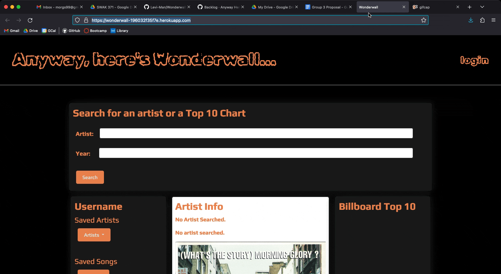

# Anyway, Here's Wonderwall 🎸

### Table of Contents
  * [Description](#description)
  * [Deployed Application](#deployed-application)
  * [Usage](#usage)
  * [Credits](#credits)
  * [License](#license)
  * [Authors](#authors)

## Description
As a music lover who lives in yesteryear, I want to look up the hits from the last great decade.

The Wonderwall Website allows a user to search for artists and scroll through their discography (via generated album covers), or look up the Billboard Top 10 from any year to find songs they want to revisit that nostalgia wave with.

A user can keep track of artists, songs, or top 10 charts in their profile.

## Deployed Site
[Anyway, Here's Wonderwall](https://wonderwall-196032f35f7e.herokuapp.com/)

## Usage
 
 

Once users have logged in they can:
 - search for artists, returning artist info from Musicbrainz.org, the largest library of artist info
 - pull up a Billboard Top 10 chart for a certain year, and search for artists from that chart
 - scroll through an artists discography via album covers
 - save songs from a chart

### Credits
[Musicbrainz Database / API](https://musicbrainz.org/) 
[CoverArt Archive](https://coverartarchive.org/) 
[Billboard Top 100 NPM Library](https://www.npmjs.com/package/billboard-top-100) 
[Carousel from w3 Schools](https://www.w3schools.com/howto/howto_js_slideshow.asp) 
[Google Fonts](https://fonts.google.com/) 
[Bootstrap CSS Library](https://getbootstrap.com/) 
[NPM](https://www.npmjs.com/)
 - Libraries Used: bcrypt, express, express-handlebars, mysql2, sequelize

#### License
[MIT License](https://www.mit.edu/~amini/LICENSE.md) 

Copyright (c) [2024]

### Authors
[Levi-Man](https://github.com/Levi-Man)  
[TammyH7](https://github.com/TammyH7)  
[morgs999](https://github.com/morgs999)  